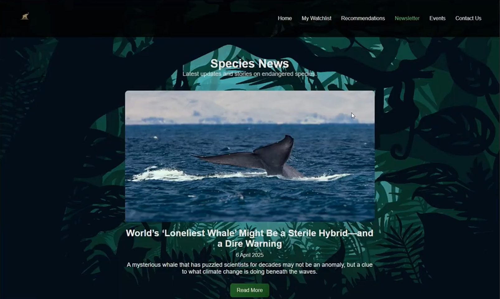

# Planet Species (Endangered Species Tracker)




    # Planet Species

A full-stack MERN application designed to raise awareness for endangered species. This project features real-time news aggregation, a custom events management system, and interactive educational tools.

This repository contains my individual contributions to the project — the Events, Newsletter, and Contact Us features — developed independently across the full stack.

## What I built

**Newsletter** — fetches live articles from NewsAPI via a scheduled cron job. Uses MongoDB `bulkWrite` to sync new articles and prevent duplicate entries, so the page always reflects current news without any manual updates.

**Events** — displays conservation events stored in MongoDB. Originally intended to pull from the Eventbrite API, but after that proved unreliable for this use case, I built a static dataset of real conservation events with client-side filtering by category and date window.

**Contact Us** — a feedback form with frontend validation and a POST route to an Express handler that stores submissions in MongoDB. Returns a confirmation to the user on success and an error message if the required message field is missing.

## Stack

- **Frontend:** React, Axios, HTML, CSS
- **Backend:** Node.js, Express
- **Database:** MongoDB, Mongoose
- **Other:** NewsAPI, node-cron

## Architecture

Each feature follows the same pattern: React component → Axios request → Express route → Mongoose model → MongoDB. Sequence diagrams were produced during the design phase to map data flow before implementation.

Three REST endpoints:
- `GET /api/newsletters`
- `GET /api/events`
- `POST /api/contact`

## Setup

**Prerequisites:** Node.js, MongoDB (local or Atlas), NewsAPI key

```bash
# Clone
git clone https://github.com/zaiddrr/Planet-Species.git

# Install backend dependencies
cd planetspecies/backend && npm install

# Install frontend dependencies
cd ../frontend && npm install

# Create .env in backend/
MONGO_URI=your_mongodb_connection_string
PORT=5000
NEWS_API_KEY=your_newsapi_key

# Run backend
cd backend && npm start

# Run frontend (separate terminal)
cd frontend && npm start
```

## Notes
This repository highlights my **individual contributions** to the "Planet Species" group project. It isolates the specific modules (Events, Newsletter, Contact) developed independently to demonstrate personal technical contributions.